# Othello Flask Implementation

This project is a Flask implementation of the board game Othello, with an AI that plays against you and a dynamically updating board on the webpage. The game can also be played through the command line with 2 players using a seperate module.

## Usage

## Components Module

This module has a series of functions that are essential to computing the core aspects of the game: initialising the board, printing the board and checking the validity of moves. This is needed as it provides the fundamental functionality needed to implement othello.

### initialise_board function

---
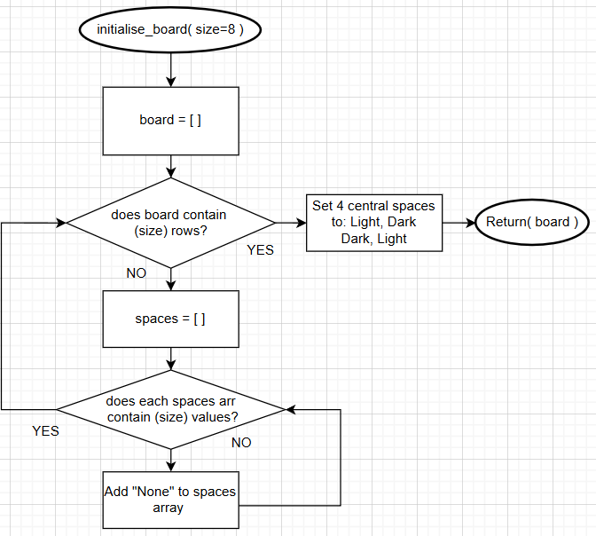

This function passes through a default value for size as 8, this ensures that the board is created with 64 spaces default whilst allowing the user to change the size themselves. This function as it creates the board the game is played on. I have used a nested loop here to add none to all of the tiles initially as this will create a board that has size * size dimensions, and in the default case, 8 columns and 8 rows. Setting the 4 central spaces in this arrangement is significant as it sets up the board for starting the game.

### print_board function

---
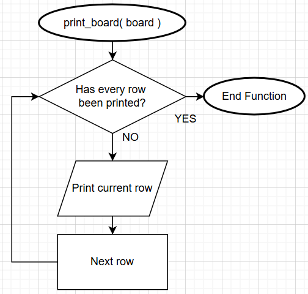

This function is fairly simple, a board object is passed through and printed. This is needed to print the board state for the command line version of the game. I have chosen to print the board row by row with a for loop as this gives the board a grid shape. Printing the board in one print statement would not give the 8x8 shape wanted.

### legal_move function

---

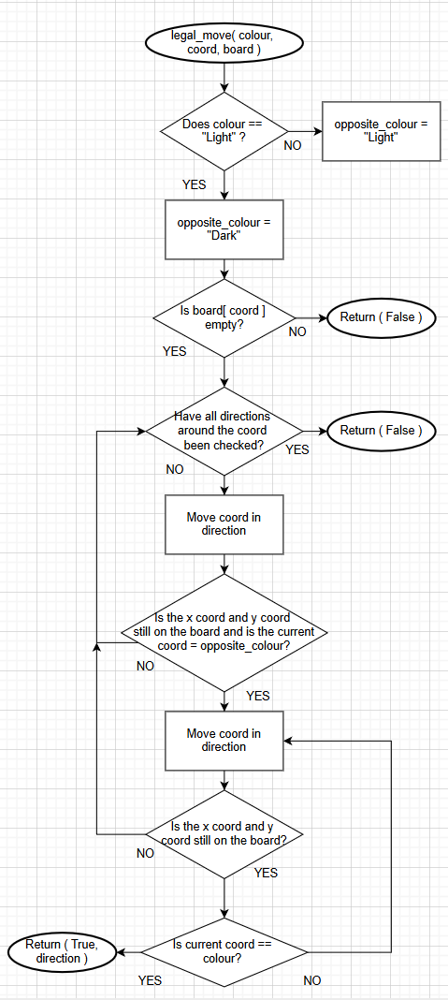

This function takes a colour, coord and a board object as parameters to check if there are any legal moves for that colour at the coord passed through. This is needed so that moves can be checked for legality before being commited to the board state. I have set an opposite_colour variable that stores the other colour not passed through as this will be used later in the function to check whether to keep moving in the current direction. An initial check to see if the current tile is empty is necessary as a tile cannot be placed in a space that already has a tile present. In the actual code, I have defined an array containing direction tuples:

`direction_arr= [(0, 1), (1, 1), (1, 0), (1, -1), (0, -1), (-1, -1), (-1, 0), (-1, 1)]`

All of these directions stored are changes to the x and y coords that allow for checking of all 8 directions including diagonals around the starting coord. E.g. (0,1) will transform (x,y) into (x + 0, y + 1). I have chosen to implement the checking of moves using this array as it allows iterative movement of a coord in a specific direction. Significantly, calling elements in the board array is done using `board[y][x]` as the first index denotes row and the second index denotes the column. This iterates until the conditions are met that determine the validity of a move. The way I have written the code, which is slightly different to the flow diagram, allows multiple directions to be valid for a given coord which is inline with the othello rules. If a coord has more than one valid direction all of those directions will outflank the other colours tiles. I have then used a nested loop with a while and for loop to implement the direction checks. This means that the while loop runs for every direction. The while loop runs while the current coord is on the board and its of the opponents colour. Both x and y coords are incremented once before the start of the while loop because the while loop would not run otherwise as the current tile would never be the opposite colour. The coord is incremented by the current direction at the end of the while loop in the program, so conditions that break the while loop are checked inside. One of the conditions that is checked is if the coord is out of bounds of the board. If the current coord is out of bounds, that means that the move is not valid hence breaking out of the while loop and iterating to the next direction. The other condition that is checked is if the current coord is the current players colour. If it is, this means that the direction is legal as it will trap opponents tiles between 2 tiles.

I have slightly modified this function from the specification, so that it returns the directions of the move if it is valid alongside True or False. This allows for more efficient tile flipping in the main loop without having to check every direction again. In the actual code, the function returns `False, None` when there are no valid moves as there will be no directions to be returned.

## Game Engine Module

This module implements a simple version of othello through the command line for 2 players to play, using a game loop that runs until the game is finished. Functions from the components module are also used within. This module is needed so a simpler version of the game without flask dependancies can be played.

### cli_coords_input

---

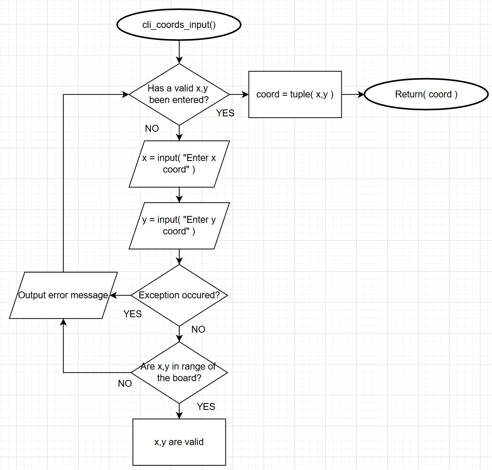

This function takes x and y inputs from a user, validates and sanitises the input and returns the coord as a tuple. This is needed to ensure users moves are sent back to the game loop in the right format, and to catch erroneous inputs being entered. I have used a while loop here that runs whilst a valid coord hasnt been entered. This allows for re-entering of x and y values after invalid inputs by the user. In the code I have used try/except error handling to catch errors where integers are not entered. I have used this as it's a good way to catch specific errors or cases. Casting both inputs to integers  can cause a `ValueError` which is caught by the except block. This block prints an error message and I have then used a continue statement to run the next iteration of the while loop. If x and y are accepted as integers an additional check is made to see if both x and y are in bounds of the board. If they aren't another continue statement has been used. If the x and y are within bounds the coord is now valid which will terminate the while loop. A coord tuple with (x,y) is then created and returned to the main game loop. Both x and y values are sanitised to be the inputted values -1 to keep inline with the 0 indexed array the board is stored in. The inputs will be between 1-8 whereas the values used in the code will be between 0-7.

### player_swap function

---

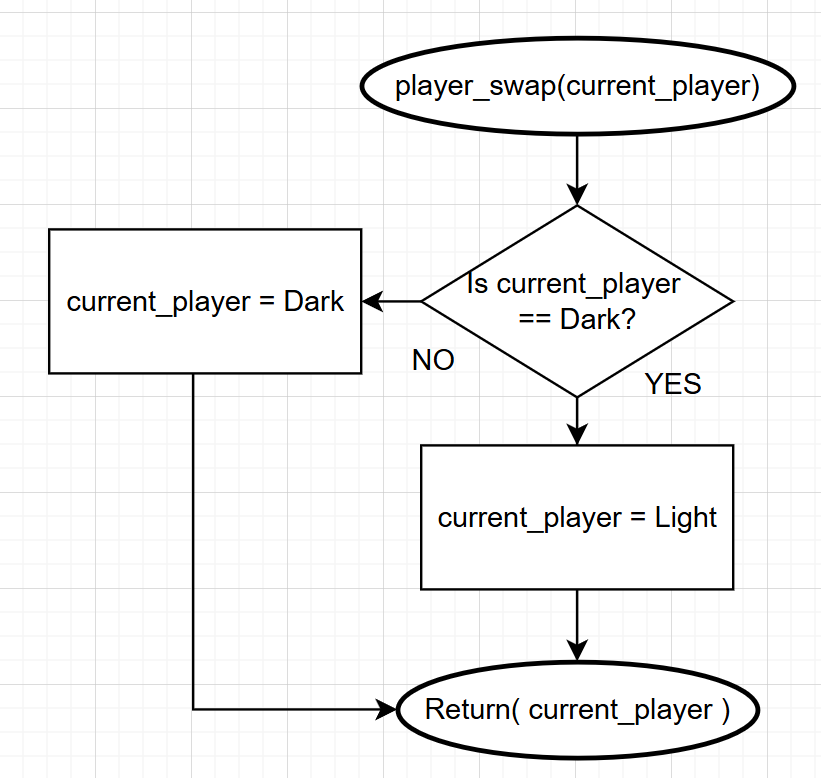

This is a simple function that takes in the current player as a parameter and swaps this to the other player. I have chosen to create this alongside the functions in the specification as its an extremely common process that needs to happen in both the command line and flask game engines multiple times. Selection has been used here to swap the current player based on the player passed through e.g. light to dark or vice versa.

### simple_game_loop function

---

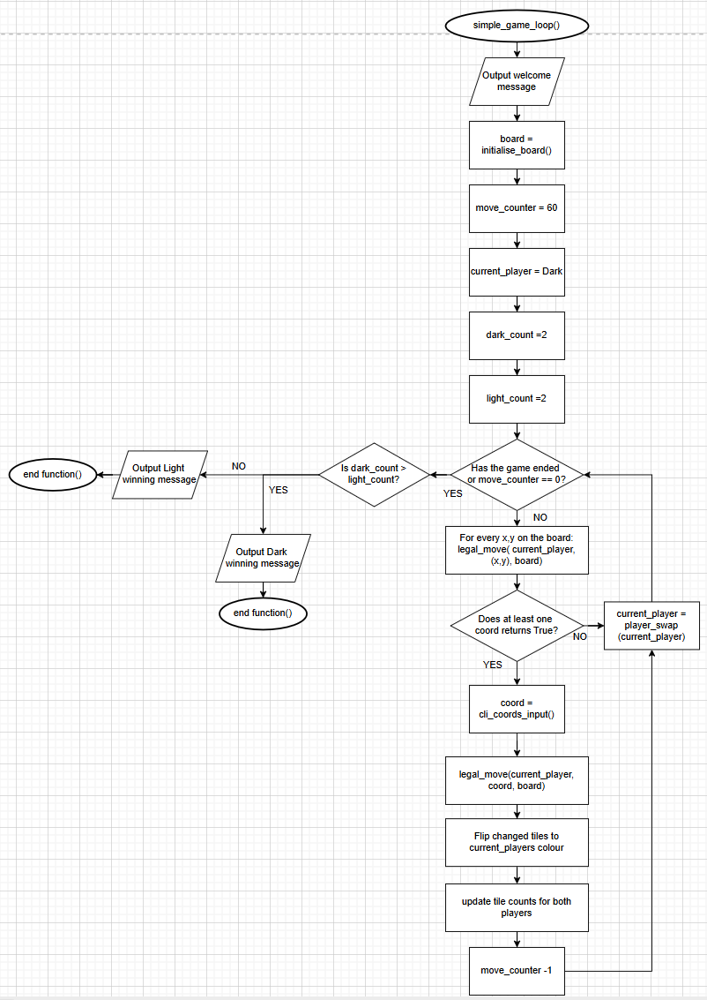

This function implements the core gameplay loop needed to play Othello through the command line, using other functions from this module and functions from components within. This is needed as it gives the game structure and allows it to actually be played by 2 players. A board object is initialised and other variables are set up before the loop begins. Both `light_count` and `dark_count` are initially set to 2 due to the starting condition of the board. I have used quite a few nested loops in this function to implement the loop. The outermost loop runs whilst the game hasn't ended and `move_counter` is not 0. This keeps the inner sequence running until the end of the game.

The first nested while loop checks that there are legal moves for the current player, by iterating through the board and calling the `legal_move()` function at every coord. An array stores True or False for each move. If there is at least one move thats legal, using the `in` statement, the player has been selected and `swap_counter` is set to 0 so this loop terminates. This counter is a significant variable as it is used to determine if both players cannot make legal moves. If no legal move is found the swap counter is incremented by 1 and the current player is swapped. The while loop runs again for the other player, resulting in a swap counter of 2 if both players have invalid moves. This is checked in an if statement after no legal move has been found, leading to the end of the game. The outer loop is also broken out of to prevent the rest of the loop running when the game has ended. Swap counter is set to 0 after valid moves are found to eliminate the chance of the game ending unintentionally.

The next nested while loop runs whilst the current player has not selected a valid coord. A coord is first chosen using `cli_coords_input()` before `legal_move()` is run again but just for the coord entered. The legality of the move has to be checked again as the first loop just checks if legal moves are present. The user could ultimately enter any coord on the board hence the rechecking. If an invalid move is entered, a suitable message is outputted to the command line and the while loop increments. If a valid move is entered, the valid directions of this move are used to flip these tiles to the current players colour. Initially, both of my `flank_count` and `replace_count` variables are set to 1 and 0 respectively, there is a subtle difference between these variables. Flank_count represents the number of tiles swapped to the current colour, whereas replace_count represents the number of tiles of the opposite colour that have been replaced. Flank_count is initially set to 1 as the free space at the coord entered will be set to the colour of the current player. Both of these variables are used later in the function to update colour counts accordingly. In regards to the flipping algorithm, a section of code runs for each direction that is similiar to the flow of the valid move algorithm. Instead of returning true when the current players colour is found, each coord in `flip_arr` is set to the current colour. When a coord is moved to that is the other colour, replace_count is incremented by 1 and the coord is appended to flip_arr. The coord is also incremented again. I have decided to store the coords to flip in an array as this allows for a simple way to change all of these elements through a for loop.

The tile counts for both players are now updated, with the current players count incrementing by the value stored in flank count, and the other colour decrementing by the value stored in replace count. The other colour count is reduced as tiles have been flipped to the current colour. This is needed as it ensures tile counts stay accurate for both players. The player is then swapped as this concludes the turn for the current player. The coord has also been chosen so this while loop is terminated.

After the outer loop has finished i.e. when the game has ended, the tile counts for both players are compared using if/elif/else statements to determine the winner. I have included an else that runs if both players have the same number of tiles which could be a possibility. Handling edge cases like this ensures the loop runs smoothly without errors.

## Flask Game Engine Module

This module implements the flask version of the game, with app routes for every function and an AI opponent to play against. This version also includes saving and loading capabilities through the use of json files. This is a significant module as it allows the game to be played through a front end user interface against an AI.

### check_all_moves function

---

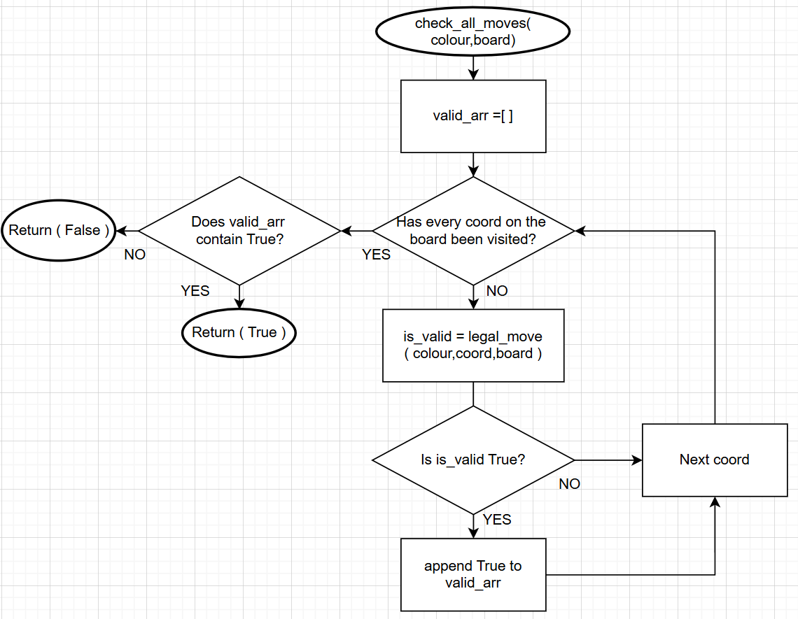

This is an additional function I have made alongside the specification, that checks if there are any valid moves for a certain colour, returning True or False. I have decided to make this function as it increases the readability of the app routes it is used within. This functionality is also needed more than once in the module, being used when determining player swaps or ending the game.

The board object is iterated through using a nested for loop. The `legal_move()` function from the components module is called on every coord for the colour passed through. This method is used as it is very thorough, ensuring that valid moves are always found if they exist. If at least one move is valid out of every move checked, the function returns True otherwise it returns False.

### tile_counts function

---

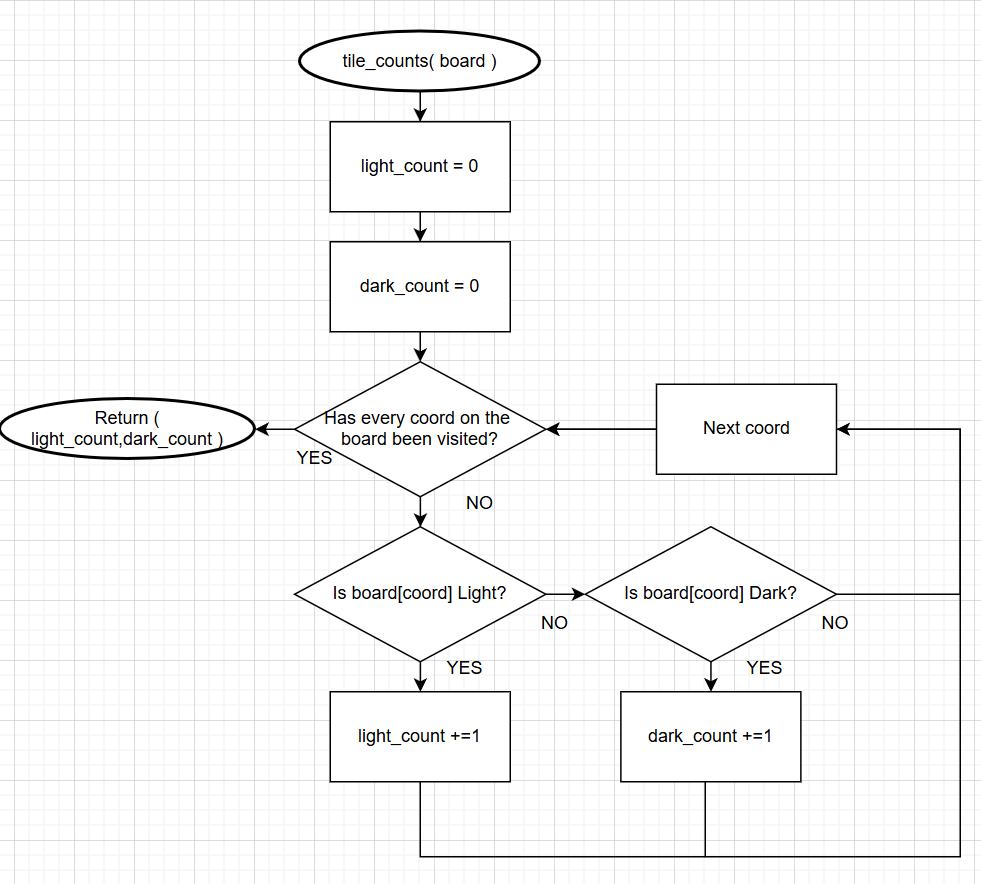

This is another additional function that I have decided to create for the sake of modularity. This function counts the number of light and dark tiles on the board before returning both. This is needed to determine the winner of the game after it has ended depending on the highest tile count.

The board object is iterated through and each coord is checked to see if its light or dark. These counts are incremented accordingly depending on the colour of the tile. I haven't used an else statement here as the coord being empty does not increment any of the variables, it just iterates to the next coord.

### ai_move function

---

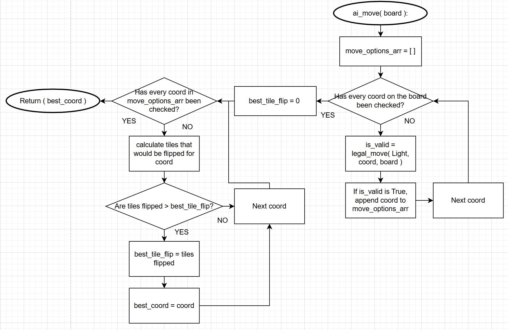

This function takes the board object as a parameter and performs a series of processes to determine a move for the AI opponent given the current board state. The coord of the move is returned to the main program. The way I have implemented this does make the AI slightly harder to beat as it will pick the move that results in the greatest number of tiles being flipped. Although, this may not be the best move as it could set up a good move for the user. This function is needed as it allows the user to play against an AI opponent by picking a valid coord for its move.

Each coordinate is checked for validity by calling the legal_move function. If this returns true, the coord and its corresponding directions are added to 2 distinct arrays: `move_options_arr` and `directions_arr`. Both of these are significant as one stores all the valid coords and the other stores all the valid directions for that coord. These will both be kept in sync with each other as values are appended in the same if block. This means that the same index called on both arrays will return the right pair of coords and directions.

After this, a similiar tile flipping mechanism to the one found in `simple_game_loop()` has been used to determine the move that flips the most tiles. Each coord is iterated through and within each valid direction for that coord is iterated through. This is to ensure that every tile count is checked. The tile flipping functions the same as previously however whilst the current coord is still the opposite colour, a tile flip counter is incremented by 1. When the tile flipping has stopped by breaking out of the loop, the tiles flipped are compared to the highest number of tiles flipped, and the highest number is updated if necessary. This ensures that the highest tile count is always kept accurate. `best_tile_flip` is initially set to 0 as allows for an accurate comparison of variables. After this, the best coord that flips the most tiles is returned to the main program.

### start_game function

---

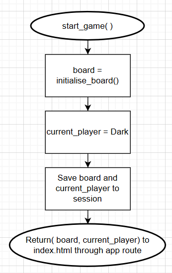

This function is very simple. Its main purpose is to assign initial variables and render the index template on the front end, ready for users to proceed with the game. The initial variables set up are the board and the current player. I have made use of flask sessions here to store these variables. Sessions allow for variables to be used between app routes without having to set their scope to global. This is significant as the variables in the backend need to be kept consistent across app routes.

### process_move function

---

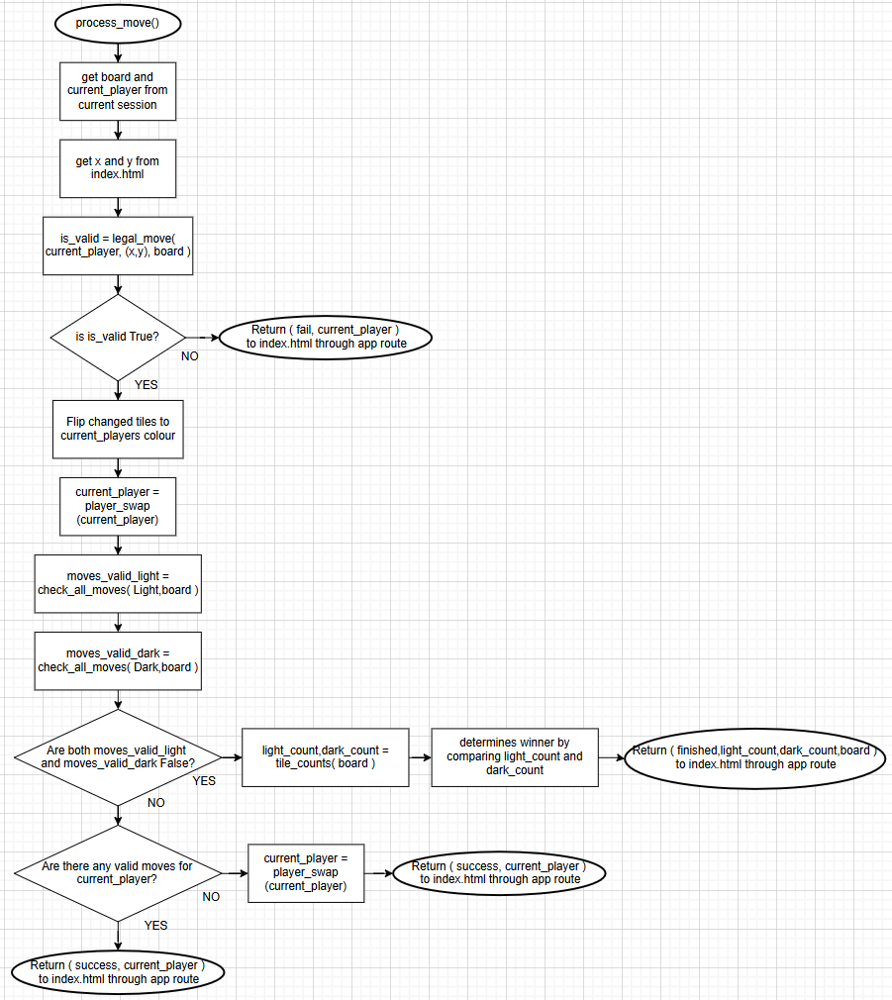

This function processes move played by both the user and the AI when the `/move` route is called from the frontend. This includes checking the legality of inputted moves, flipping tiles, changing players and ending the game if necessary. This function is significant because it is the main app route that provides functionality to the frontend, without this the game would not progress and the board wouldn't update dynamically.

Initially both the board object and the current player are retrieved from the session. This allows them to be used and modified in this app route. In the actual code, if the current player is the AI, the `ai_move` function is called to return a coord. I have used `time.sleep(1)` before this to allow some time between the board updating from a player move and it updating for the ai move. Through some basic manual testing before using `sleep`, I found that the user would not have time to see the board after their move before the AI move appears. If the current player is the user then the x and y coords are retrieved from the front end with `request.args()`.

Most of the code in this function is similiar in structure to the tile flipping in the simple game loop, with a few key differences. The return statements use the `jsonify` function to return data to the front end, ensuring that data is passed through in the correct JSON format. The availability of moves is checked at the end of the function because the contents of the board has changed after a valid move has been made. This also ensures that the user doesn't have to click again to see the latest update to the game condition. After a valid move both the board and the current player are stored to the session for use the next time the function is called. The game ends when the `check_all_moves()` function returns False for both light and dark as neither player can make a valid move. If one colour has no valid moves and its currently that colours turn, the player is swapped again so that the game can continue when one player doesn't have any valid moves.

### save_game function

---

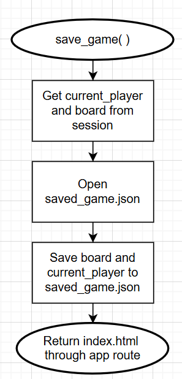

This function is called when the user clicks on the save game button in the front end and it saves the variables `current_player` and `board` to a json file. This is important as it allows games to be saved, maintaining the current board state until the user loads the game. In the code I have first put both variables into a dictionary because this is a format that can easily be converted to json. Using the `with open()` command is significant as the file will be automatically closed after the data is saved to the file. This prevents issues with the file being left open from occuring.

### load_game function

---

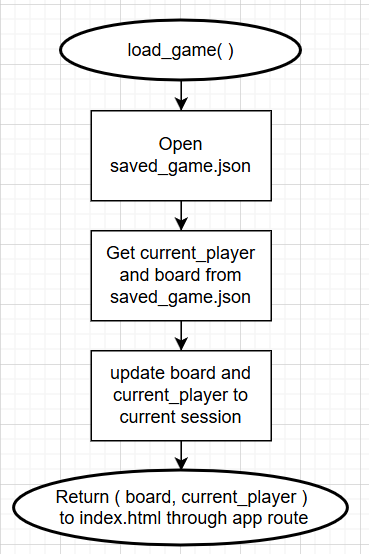

This function runs when the load game button is clicked in the front end, it loads the variables saved in the json file, converts them from json to be stored in a session and returns them to the front end. The same `with open()` command is used here to achieve the same purpose. The variables are updated in the session so they are accurate for when other app routes are called.

## Changes made to index.html

I have made a few changes to the index.html file provided in the specification to implement the AI move and save/load functions.

I have modified the `sendMove(x, y, url)` function to include an additional `fetch(url+'?x=0&y=0')` command after the coord chosen by the user has been successful. This is so that the AI move will run after a successful move by the user. X and y have been returned as 0 here as these are not relevant for computing the AI's move but they have to be returned with this url regardless.

Another 2 functions that had to be implemented are `saveGame()` and `loadGame()`. These provide functionality to the saving and loading buttons through an `onclick` attribute. Fetch methods are used to run the corresponding functions in python. The message box is then updated on the webpage to show that these processes have happened successfully. In `loadGame()`, the board is also updated using `loadBoard()` after a response from python
to show the new board state.

---

### License: MIT, see LICENSE.txt for more details

### Author: Harry Williams
